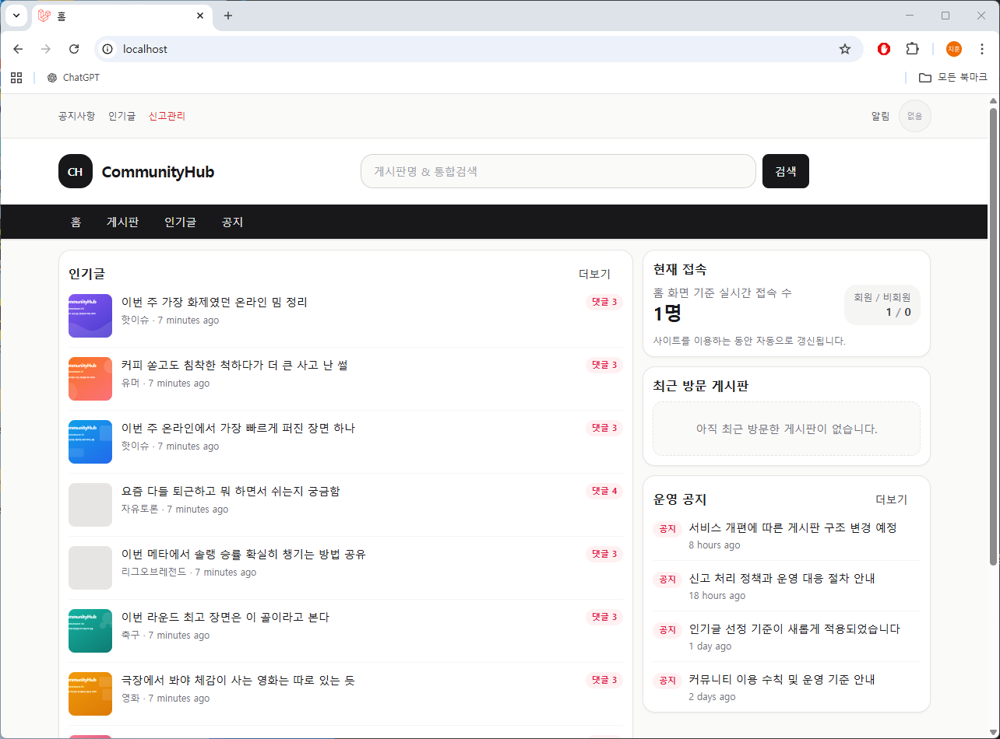
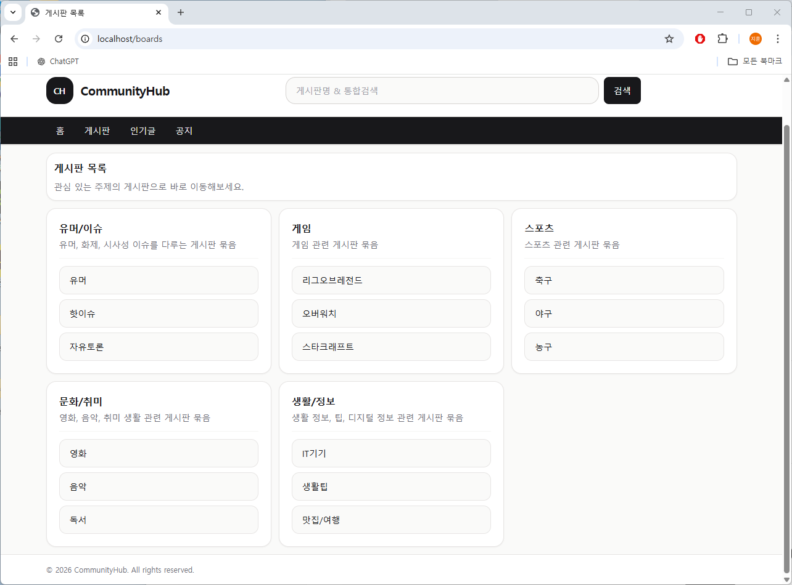
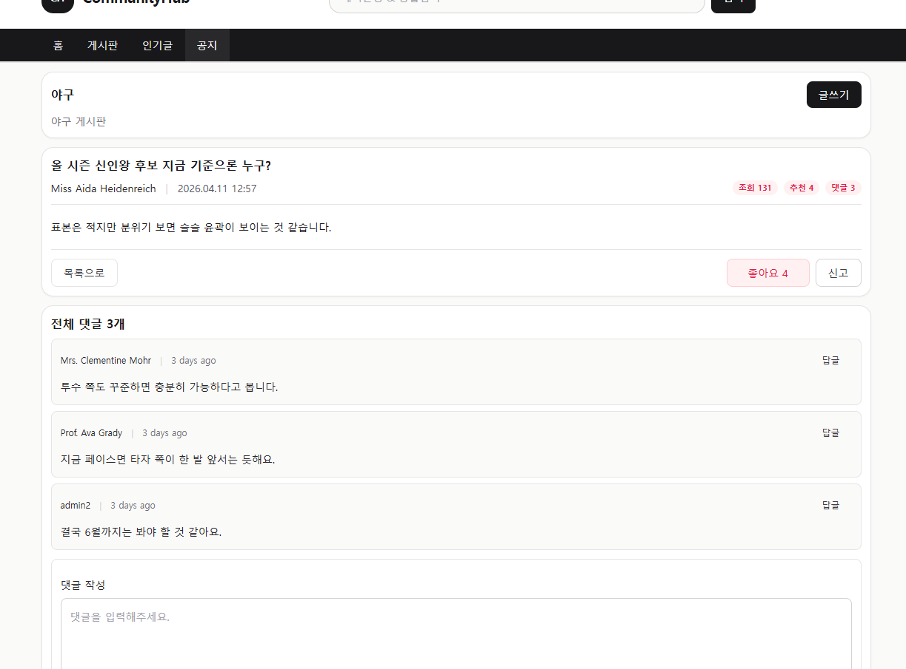
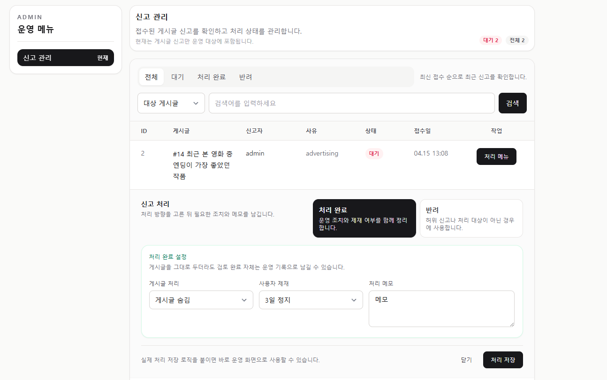

# CommunityHub

> Laravel 기반 커뮤니티 플랫폼

CommunityHub는 Laravel 12를 기반으로 만든 커뮤니티 서비스입니다.  
게시글, 댓글 같은 기본 기능에 더해 신고, 사용자 제재 등 운영 기능까지 포함해  
단순 CRUD를 넘어 실제 서비스 구조를 구현하는 것을 목표로 개발했습니다.

---

## 왜 이 프로젝트를 만들었는가

기존에 PHP 기반으로 개발을 해왔지만,  
프레임워크를 활용한 구조적인 개발 경험이 부족하다고 느껴 Laravel을 학습하게 되었습니다.

단순 기능 구현을 넘어 실제 서비스 구조를 이해하기 위해,  
게시판뿐 아니라 운영 기능까지 포함한 커뮤니티 플랫폼을 직접 설계하고 구현했습니다.

---

## 🛠 기술 스택

- Laravel 12 (PHP)
- Blade, Alpine.js, Tailwind CSS
- MySQL
- Redis
- Laravel Sail (Docker)
- Vite
- PHPUnit

---

## 📸 주요 화면

### 홈


### 게시글 목록


### 게시글 상세


### 관리자 (신고 처리)


---

## ✨ 주요 기능

### 커뮤니티
- 게시글 / 댓글 / 대댓글 CRUD
- 게시판 및 카테고리 구조
- 검색 및 페이지네이션

### 상호작용
- 좋아요
- 조회수
- 인기글 시스템
- 알림

### 운영
- 게시글 신고
- 콘텐츠 숨김 / 삭제
- 사용자 제재 (경고 / 정지 / 차단)
- 운영 이력 관리 및 알림

---

## 구현 포인트

### 운영(Moderation) 구조
신고 → 처리 → 제재 → 알림 흐름으로 연결되는 구조를 설계했습니다.

- `reports`: 신고 접수
- `moderation_actions`: 처리 이력
- `user_sanctions`: 제재 관리
- `notifications`: 사용자 알림

---

### 인기글 시스템
실시간 정렬 대신, 조건을 만족한 게시글을 따로 저장하는 방식으로 구현했습니다.

- `popular_posts` 테이블로 이력 관리
- 홈에서는 해당 데이터를 기준으로 노출

---

### 파일 업로드 처리
이미지 업로드 시 바로 연결하지 않고 임시 상태를 거쳐 처리했습니다.

- `is_temporary`로 상태 관리
- 게시글 저장 시에만 연결
- 미사용 파일은 스케줄러로 정리

---

### 트랜잭션 처리
게시글 생성과 첨부파일 연결을 하나의 트랜잭션으로 묶어  
데이터 불일치가 발생하지 않도록 처리했습니다.

---

### 성능 고려
- 인기글 캐시 (`Cache::remember`)
- eager loading 적용
- pagination 적용

---

## 문제 해결 경험

### 이미지 업로드 후 남는 파일 문제
글 작성 중 업로드된 이미지가 남는 문제를 해결하기 위해  
임시 저장 → 실제 사용 시 연결 → 스케줄 정리 구조로 개선했습니다.

---

### 인기글 설계 문제
실시간 점수 기반 정렬은 변동이 커서  
선정 이력을 따로 관리하는 구조로 변경했습니다.

---

### 폼 데이터 충돌 문제
댓글 작성 / 수정 / 답글 폼이 동시에 존재하면서  
필드 값이 섞이는 문제가 있어 필드명을 분리해 해결했습니다.

---

## 🗄 데이터 구조

- Users: 역할, 상태, 제재 정보 관리
- Posts / Comments: 작성자 snapshot 유지
- Attachments: 파일 및 임시 상태 관리
- Moderation: 신고 / 처리 / 제재 이력 분리 구조

---

## 실행 방법

```bash
./vendor/bin/sail up -d
./vendor/bin/sail artisan key:generate
./vendor/bin/sail artisan migrate --seed

./vendor/bin/sail npm install
./vendor/bin/sail npm run dev
````

접속:

* [http://localhost](http://localhost)
* [http://localhost:8025](http://localhost:8025)

---

## 배운 점

* 단순 CRUD를 넘어 운영 구조까지 고려하는 경험을 할 수 있었습니다.
* 파일 업로드, 제재 시스템 등 실제 서비스에서 필요한 요소를 고민하며 구현했습니다.
* Service 분리와 Model Scope를 활용해 코드 구조를 개선하는 방향으로 개발했습니다.